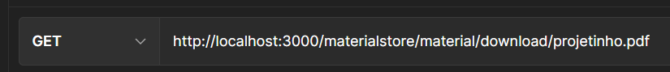

# MATERIAIS-ADAPTADOS-API

<h1 align="center">
  
</h1>

## Introdução

Olá, bem vindas à documentação da MATERIAIS-ADAPTADOS-API, meu projeto final para o curso de desenvolvimento backend da {Reprograma}. Trata-se de uma aplicação que é destinada para armazenar materiais escolares adaptados para crianças com atraso no desenvolvimento e comorbidade motoras que estão no processo de alfabetização.

## Funcionalidades

- [x] A API torna possível realizar o cadastro de usuários
- [x] A API torna possível realizar o login com o usuário cadastrado
- [x] A API torna possível excluir o usuário cadastrado

---

- [x] A API torna possível realizar o upload do material adaptado, onde o arquivo é armazenado na Amazon S3 e as informações no MongoDB Atlas
- [x] A API torna possível realizar o download do material adaptado, onde o arquivo é armazenado na Amazon S3 e as informações no MongoDB Atlas
- [x] A API torna possível realizar a atualização da descrição do material no Mongo DB Atlas
- [x] A API torna possível realizar a exclusão do arquivo na Amazon S3 e cadastro no Mongo DB Atlas
- [x] A API torna possível listar todos os materiais
- [x] A API torna possível listar o material por ID

## Guia de uso

Para realizar o UPLOAD do material é necessário realizar o seguinte procedimento:

> {<br>
> 1°: Clicar em Body;
> 2°: Alterar o tipo para "form-data";
> 3°: Escreve "file" na key e alterar o tipo para File;
> 4°: Em value anexar o arquivo;
> 5°: Clicar em Send; <br>
> 
> }
> <br>

Para realizar o DOWNLOAD do material é necessário realizar o seguinte procedimento:

> { <br>
> 1° alternativa: Insira a rota e clique em send
> (Caso o postman não faça o download automaticamente, tente a 2° alternativa);
> 2° alternativa: Insira a rota no campo de pesquisa do navegador
> 3°: Escreve "file" na key e alterar o tipo para File
> 4°: Em value anexar o arquivo
> 5°: Clicar em Send <br>
>  <br>
> OU <br>
> 
> }
> <br>

## Rotas

A partir das requisições para a API, é possível:

<table>
<tr>
  <td>Verbo</td>
  <td>Rota</td>
  <td>Função</td>
</tr>
<tr>
  <td>post</td>
  <td>"/materialstore/user/add"</td>
  <td>Cadastrar usuária</td>
</tr>
<tr>
  <td>post</td>
  <td>"/materialstore/user/login"</td>
  <td>Realizar login</td>
</tr>
<tr>
  <td>delete</td>
  <td>"/materialstore/user/:id"</td>
  <td>Deletar usuária</td>
</tr>
<tr>
  <td>post</td>
  <td>"/materialstore/material/add"</td>
  <td>Adicionar material</td>
</tr>
<tr>
  <td>get</td>
  <td>"/materialstore/material/all"</td>
  <td>Listar todos os materiais</td>
</tr>
<tr>
  <td>get</td>
  <td>"/materialstore/material/:id"</td>
  <td>Listar material por id</td>
</tr>
<tr>
  <td>get</td>
  <td>"/materialstore/material/download/:filename"</td>
  <td>Realizar download do material</td>
</tr>
<tr>
  <td>delete</td>
  <td>"/materialstore/material/delete"</td>
  <td>Deletar material</td>
</tr>
<tr>
  <td>patch</td>
  <td>"/materialstore/material/update/:id"</td>
  <td>Atualizar material por id</td>
</tr>
</table>

A documentação também pode ser acessada [aqui](https://materiais-adaptados.onrender.com/minha-rota-de-documentacao/).

## Instalação

```bash
# Clonar o repositório
$ git clone https://github.com/taytark/projeto-final
# Entrar na pasta do repositório
$ cd projeto-final
# Instalar as dependências
$ npm install
# Executar o servidor
$ npm start
```

## 👩🏾‍💻 Tecnologias e Dependências Utilizadas

<br>

| Ferramenta      | Descrição                                                                                                                                |
| --------------- | ---------------------------------------------------------------------------------------------------------------------------------------- |
| `javascript`    | Linguagem de programação                                                                                                                 |
| `node.js`       | Ambiente de execução do javascript                                                                                                       |
| `express`       | Framework NodeJS                                                                                                                         |
| `mongoose`      | Dependência que interage com o MongoDB para a conexão da database, criação do model e das collections                                    |
| `nodemon`       | Dependência que observa as atualizações realizadas nos documentos para rodar o servidor automaticamente                                  |
| `npm ou yarn`   | Gerenciador de pacotes.                                                                                                                  |
| `MongoDb`       | Banco de dados não relacional orietado a documentos                                                                                      |
| `Mongo Atlas`   | Interface gráfica para verificar se os dados foram persistidos                                                                           |
| `Postman`       | Interface gráfica para realizar os testes                                                                                                |
| `jsonwebtoken ` | Dependência que implementa o protocolo JSON Web Token                                                                                    |
| `bcrypt`        | Bcryptjs é uma biblioteca para encriptação de dados. Neste caso, o dado a ser criptografado é o password                                 |
| `dotenv`        | Dependência para gerenciar facilmente variáveis de ambiente, não é obrigatório para JWT, mas uma boa prática para configurações em geral |
| `aws-sdk`       | CLI para trabalhar com serviços AWS                                                                                                      |
| `multer`        | Multer é um middleware node.js para manipulação multipart/form-data, que é usado principalmente para fazer upload de arquivos            |
| `multer-s3`     | Mecanismo de armazenamento múltiplo de streaming para AWS S3                                                                             |
| `swagger`       | Gera a documentação                                                                                                                      |
| `render`        | hospeda a documentação                                                                                                                   |
| `dotenv`        | Dependência para gerenciar facilmente variáveis de ambiente, não é obrigatório para JWT, mas uma boa prática para configurações em geral |

<br>

<br>
Link para a documentação:

📝 [Swagger](https://materiais-adaptados.onrender.com/minha-rota-de-documentacao/)

📝 [Render](https://materiais-adaptados.onrender.com/)
<br>

## Contato

[LinkedIn](https://www.linkedin.com/in/tayane-pereira/ "LinkedIn")
